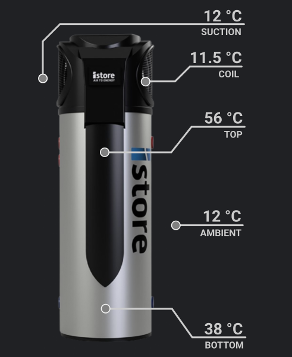
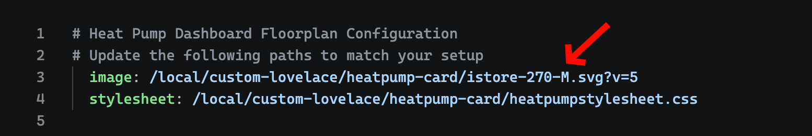
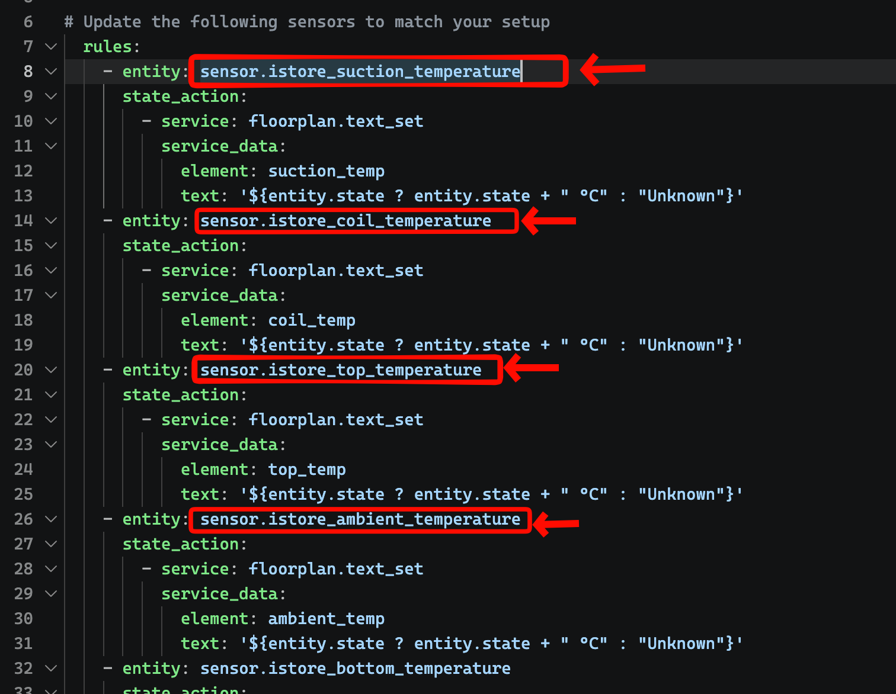
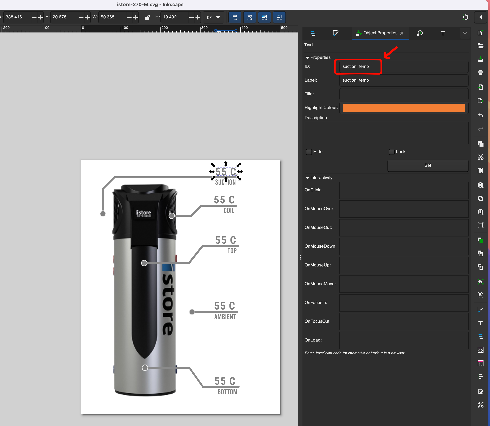

# istore-heatpump-card

An [iStore](https://heatpumps.istore.net.au/) heat pump dashboard card built using the [ha-floorplan](https://github.com/ExperienceLovelace/ha-floorplan) custom component for Home Assistant.

## Preview


## Prerequisites

- Install [ha-floorplan](https://github.com/ExperienceLovelace/ha-floorplan) via HACS
- Install iStore heat pump custom integration. This is where all the sensor values are taken from - https://github.com/kungbernard/istore-ha/ 
- Power Consumption of the heat Pump is done using a seperate power metering socket (if you want that)

## Files

| File | Description |
|---|---|
| `istore-270-M.svg` | SVG image of the iStore heat pump. Contains the lines, labels, and entity ID relationships for each temperature sensor location. |
| `heatpumpstylesheet.css` | Stylesheet for the floor plan card. Controls panel sizing and visual styling of the heat pump diagram. |
| `heatpumpdashboard.yml` | Floorplan card configuration. References the SVG and stylesheet, and contains rules that map Home Assistant sensor entity IDs to SVG element IDs. |

## Installation Steps

1. Install ha-floorplan from HACS. Make sure you can use `custom:floorplan-card` in your Lovelace dashboard.
2. Copy the three files into the Home Assistant `www` folder, e.g.:
   ```
   homeassistant/config/www/custom-lovelace/heatpump-card
   ```
3. Update the CSS and SVG file paths in `heatpumpdashboard.yml`:
   
4. Update the sensor entity IDs in `heatpumpdashboard.yml` with your own sensor IDs:
   
5. Include the `custom:floorplan-card` in your Lovelace YAML file where you want the card to appear.

## Customizing Entity IDs in the SVG

You can optionally customize the entity IDs in the SVG file by opening it in Inkscape and modifying them:



This is **not required** — you only need to update the mappings in `heatpumpdashboard.yml`.

## Limitations

- Currently works only in **dark mode**. Font colors and styling may not display correctly in light mode.
- There is no inbuilt power measuring sensor in the iStore. If you want power monitoring, you need to install a separate power metering socket. 

## References

- [ha-floorplan: How to handle size and expand](https://experiencelovelace.github.io/ha-floorplan/docs/how-to-handle-size-and-expand-floorplan/)
- [ha-floorplan: Example floorplanner home](https://experiencelovelace.github.io/ha-floorplan/docs/example-floorplanner-home/)